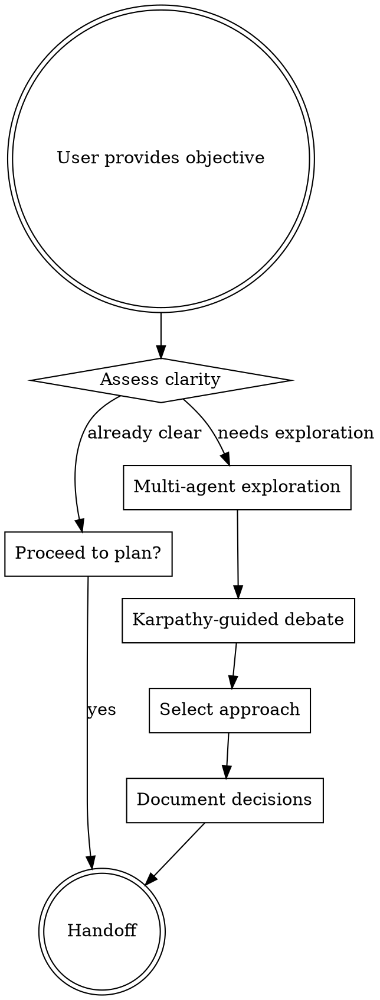

# FORGE Brainstorm

**Phase 1 of 9** - Explore ideas and approaches through collaborative dialogue and multi-agent debate.

## Philosophy

**"Debate, Don't Assume"** - Multiple agents explore approaches before deciding. Karpathy guidelines enforced throughout.

## When to Use

Use `/forge:brainstorm` when:
- Starting a new feature or component
- Multiple approaches could solve the problem
- Trade-offs need exploration
- Requirements are unclear

Skip when:
- Requirements are explicit with acceptance criteria
- Scope is constrained and well-defined
- You have a clear pattern to follow

## Workflow



## Phase 1A: Multi-Agent Exploration (Parallel)

**Agents spawn in parallel:**

| Agent | Angle | Explores |
|-------|-------|----------|
| `brainstormer` | Technical | Feasibility, architecture, performance |
| `researcher` | UX/Context | User experience, existing patterns |
| `pattern-recognition-specialist` | Patterns | Code patterns, anti-patterns in codebase |
| `best-practices-researcher` | External | Industry best practices, similar implementations |

**Each agent:**
1. Reads relevant codebase context
2. Explores their angle independently
3. Documents 2-3 approaches with pros/cons
4. **Writes to `.claude/memory/forge/brainstorm/{agent}.md`**
5. **Stops - file write is completion signal**

**Agent Invocation (using compound-engineering agents):**

```javascript
// Pattern recognition specialist - analyze codebase patterns
Task({
  subagent_type: "compound-engineering:research:pattern-recognition-specialist",
  description: "Analyze codebase for relevant patterns",
  prompt: "Analyze the codebase for design patterns, naming conventions, and architectural approaches relevant to: [objective]. Write findings to .claude/memory/forge/brainstorm/patterns.md"
})

// Best practices researcher - external research
Task({
  subagent_type: "compound-engineering:research:best-practices-researcher",
  description: "Research best practices for this feature type",
  prompt: "Research current best practices for implementing [objective]. Focus on: implementation patterns, common pitfalls, performance considerations. Write findings to .claude/memory/forge/brainstorm/best-practices.md"
})
```

**Completion Protocol:**
- Write findings using Write tool
- Do NOT use SendMessage or handoff functions
- File creation signals completion

## Phase 1B: Karpathy-Guided Debate

**Karpathy Guidelines enforced:**
- "Simpler is better"
- "Don't refactor unrelated code"
- "One logical change per edit"
- "Evidence before assertions"

**Debaters spawn in parallel:**

| Debater | Champions | Focus |
|---------|-----------|-------|
| `architect-debater` | Technical excellence | Best long-term solution |
| `ux-debater` | User experience | Best user outcome |
| `pragmatist-debater` | Simplicity | Minimal viable solution |

**Debate format:**
1. Each debater reads all exploration outputs
2. Each champions 1-2 approaches they think best
3. **Each debater writes argument to `.claude/memory/forge/debate/{role}.md`**
4. Arbiter reads all debate files
5. **Arbiter writes decision to `.claude/memory/forge/decision.md`**

**Decision criteria (weighted):**
- Simplicity (40%) - "Simpler is better"
- User value (30%) - Solves real problem
- Maintainability (20%) - Easy to change later
- Performance (10%) - Acceptable speed

## Phase 1C: Document Decisions

**Write to:** `docs/forge/brainstorm.md`

```markdown
---
date: YYYY-MM-DD
objective: "[Clear objective statement]"
artifact_level: intelligent
---

# Brainstorm: [Objective]

## What We're Building
[Concise description - 1-2 paragraphs]

## Approaches Considered

### Approach A: [Name]
[2-3 sentence description]

**Pros:**
- [Benefit 1]
- [Benefit 2]

**Cons:**
- [Drawback 1]
- [Drawback 2]

**Karpathy assessment:** [Simplicity rating]

### Approach B: [Name]
...

## Selected Approach

**Chosen:** [Approach name]

**Rationale:**
[Why this approach best balances Karpathy guidelines with requirements]

**Rejected approaches:**
- [Approach X]: [Why rejected per Karpathy]

## Key Decisions
- [Decision 1]: [Rationale]
- [Decision 2]: [Rationale]

## Open Questions (for Planning)
- [Question 1]
- [Question 2]

## Next Phase
→ `/forge:research` to validate approach with best practices
```

## Karpathy Assessment Format

For each approach, rate against Karpathy guidelines:

| Guideline | Rating | Notes |
|-----------|--------|-------|
| Simplicity | ⭐⭐⭐⭐⭐ | [Explanation] |
| Surgical precision | ⭐⭐⭐⭐☆ | [Lines of change estimate] |
| Testability | ⭐⭐⭐⭐⭐ | [How testable] |
| Evidence-based | ⭐⭐⭐⭐☆ | [What evidence supports] |

## Handoff

**After brainstorm completes:**

Use AskUserQuestion:

**"Brainstorm complete. What next?"**

Options:
1. **Research** - Validate approach with best practices (`/forge:research`)
2. **Design** - Skip to UI/UX generation (`/forge:design`)
3. **Plan** - Skip to implementation planning (`/forge:plan`)
4. **Review** - Review brainstorm document first

**If proceeding to research:**
- Pass: Selected approach, open questions
- Focus: Research targets are the open questions

## Integration

**Auto-loads:**
- `forge-config` - Artifact level and settings
- `forge-context` - Progressive context loading
- `karpathy-guidelines` - Guideline enforcement

**Auto-triggers:**
- Research phase can detect and build on brainstorm output
- Plan phase auto-detects if research exists

## State Management

**Temporary files:**
- `.claude/memory/forge/brainstorm/*.md` - Exploration outputs
- `.claude/memory/forge/debate/*.md` - Debate arguments
- `.claude/memory/forge/decision.md` - Final decision

**Kept per artifact level:**
- All levels: `docs/forge/brainstorm.md`
- Maximal: Keep exploration and debate files

## Anti-Patterns

| ❌ Wrong | ✅ Correct |
|----------|-----------|
| Single agent decides | Multiple agents debate |
| Skip debate for "simple" features | Debate everything - simplicity is discovered through debate |
| Document after deciding | Document approaches before selecting |
| Ignore Karpathy guidelines | Explicitly rate each approach against guidelines |
| "I'll know the right approach" | Test assumptions through structured debate |

## Success Criteria

Brainstorm is complete when:
- [ ] 3+ approaches documented with pros/cons
- [ ] Karpathy assessment complete for each
- [ ] Debate occurred with multiple perspectives
- [ ] Decision documented with clear rationale
- [ ] Open questions identified for next phase
- [ ] Handoff clear and actionable
