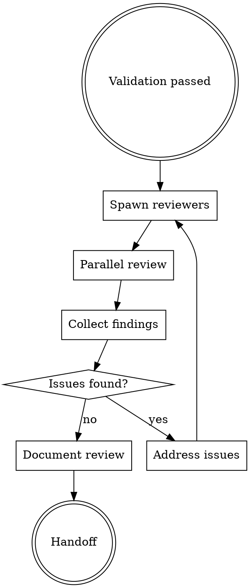

# FORGE Review

**Phase 8 of 9** - Comprehensive code review with parallel specialized reviewers and Karpathy focus.

## Philosophy

**"Review with rigor"** - Multiple specialized reviewers examine code from different angles in parallel.

## When to Use

Use `/forge:review` when:
- Validation passed
- Code ready for final review
- Quality assurance required

Skip when:
- Skipping review phase (configured)
- Solo project with self-review

## Review Workflow



## Parallel Reviewers

| Reviewer | Focus | Checks |
|----------|-------|--------|
| `karpathy-reviewer` | Surgical precision | Lines < 50, one change, no scope creep |
| `design-reviewer` | UI/UX | Design system compliance, animations |
| `performance-reviewer` | Speed | Bundle size, render perf, queries |
| `security-reviewer` | Security | Auth, injection, exposure |

## Karpathy Reviewer (Critical)

**From SLFG workflow - Karpathy Guidelines:**

```
You are a surgical code reviewer. Your job is to ensure every edit:
1. Touches minimum lines necessary
2. Does one thing only
3. Doesn't refactor "while I'm here"
4. Has evidence it works
5. Can be explained in one sentence

REJECT any edit that:
- Changes >50 lines
- Mixes concerns
- Refactors unrelated code
- Lacks test evidence
```

## Review Output Format

```markdown
---
date: YYYY-MM-DD
validation_ref: "docs/forge/validation.md"
status: approved
---

# Code Review

## Reviewers
- karpathy-reviewer
- design-reviewer
- performance-reviewer

## Karpathy Review

| Criterion | Status | Notes |
|-----------|--------|-------|
| Lines < 50 | ✅ | Max 23 lines |
| One change | ✅ | Each task focused |
| No scope creep | ✅ | No unrelated changes |
| Evidence | ✅ | Tests pass |

**Verdict:** ✅ Approved

## Design Review

| Aspect | Status | Notes |
|--------|--------|-------|
| Design system | ✅ | Colors correct |
| Animations | ✅ | Smooth transitions |
| Responsive | ✅ | Breakpoints work |

**Verdict:** ✅ Approved

## Performance Review

| Metric | Before | After | Status |
|--------|--------|-------|--------|
| Bundle size | 1.1 MB | 1.2 MB | ⚠️ +100KB |
| First render | 120ms | 125ms | ✅ |
| API calls | 3 | 3 | ✅ |

**Verdict:** ✅ Approved (size increase justified)

## Security Review

| Check | Status |
|-------|--------|
| Auth validation | ✅ |
| Input sanitization | N/A (no inputs) |
| Secret exposure | ✅ None found |

**Verdict:** ✅ Approved

## Overall

**Status:** ✅ Approved

**Required actions:** None

**Optional improvements:**
- Consider lazy loading for new component

## Next Phase
→ `/forge:learn` to capture patterns
```

## Approval Criteria

All reviewers must approve:
- [ ] Karthy guidelines followed
- [ ] Design system compliant
- [ ] Performance acceptable
- [ ] Security reviewed
- [ ] Tests passing (evidence)

## Integration

**Consumes:**
- `docs/forge/validation.md`
- Implemented code

**Produces:**
- `docs/forge/review.md`

**Hands off to:**
- `/forge:learn` - Review complete, capture learnings

## Artifact Levels

| Level | Review Depth |
|-------|--------------|
| Minimal | Karthy only |
| Intelligent | Karthy + Design + Performance |
| Maximal | All + Security + Accessibility |
